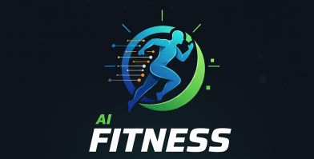

[](https://github.com/Joe-Heffer/trainer/actions/workflows/ci.yml)
[](https://github.com/Joe-Heffer/trainer/actions/workflows/dependabot/dependabot-updates)

# trAIner

An open-source agentic AI personal trainer for fitness and health that's powered by Strava data.



## Features

- **AI-Powered Coaching**: Get intelligent training advice powered by advanced LLMs
- **Strava Integration**: Automatically analyze your workouts from Strava
- **Workout Analysis**: Receive detailed feedback with personalized recommendations
- **Training Plans**: Generate customized plans based on your goals and fitness level
- **Conversational Interface**: Chat naturally with your AI trainer about training, recovery, and performance

## Quick Start

### Prerequisites

- Python 3.10+
- Google Gemini API key ([get one here](https://aistudio.google.com/app/apikey))
- Strava account ([sign up](https://www.strava.com/register))

### Installation

1. **Clone and install:**

   ```bash
   git clone https://github.com/Joe-Heffer/trainer.git
   cd trainer
   pip install -e .
   ```

2. **Set up Strava MCP Server:**

   ```bash
   # Clone and build the Strava MCP server
   git clone https://github.com/r-huijts/strava-mcp.git
   cd strava-mcp
   npm install
   npm run build

   # Authenticate with Strava (creates API app and gets tokens)
   npx tsx scripts/setup-auth.ts
   # Follow the prompts to authorize with Strava
   ```

3. **Configure environment:**

   ```bash
   cd ../trainer
   cp .env.example .env
   # Edit .env and add:
   # - GOOGLE_API_KEY: Your Google Gemini API key (https://aistudio.google.com/apikey)
   # - STRAVA_MCP_PATH: Absolute path to strava-mcp/dist/server.js
   ```

   Example `.env`:
   ```bash
   GOOGLE_API_KEY=your_gemini_api_key_here
   STRAVA_MCP_PATH=/absolute/path/to/strava-mcp/dist/server.js
   LOG_LEVEL=WARNING
   ```

## Usage

### Command line

```bash
trainer
```

For the arguments:

```bash
trainer --help
```

### Programmatic

```python
from trainer import TrainerAgent

agent = TrainerAgent()
await agent.initialize()

# Analyze a workout
analysis = await agent.analyze_workout("activity_id")

# Create a training plan
plan = await agent.create_training_plan(
    goal="Run a half marathon under 2 hours",
    weeks=12
)
```

## Example Conversation

```
💪> What should I do to improve my cycling performance?

Based on your Strava data, here's what I see:
- You've been cycling consistently with multiple rides per week
- Your distances vary from 7km to 80km
- You're incorporating regular weight training which supports cycling performance

Recommendations:
1. **Structured Training Zones:** Add interval training to improve VO2 max
2. **Progressive Overload:** Gradually increase ride duration and intensity
3. **Strength Training:** Continue your weight training - it's great for power
4. **Recovery:** Ensure adequate rest between hard efforts
5. **Nutrition:** Focus on pre-ride and during-ride fueling for longer sessions

Would you like me to create a specific training plan for your cycling goals?

💪> quit
👋 Thanks for training with trAIner!
```

## Documentation

**For Users:**

- [Installation Guide](docs/installation.md) - Detailed setup instructions
- [MCP Integration](docs/mcp-integration.md) - Connecting to Strava

**For Contributors:**

- [Contributing Guide](CONTRIBUTING.md) - How to contribute
- [Developer Guide](docs/developers.md) - Development setup and workflows
- [Architecture](docs/architecture.md) - System design and components
- [Testing Guide](docs/testing.md) - Writing and running tests

## Contributing

We welcome contributions! See [CONTRIBUTING.md](CONTRIBUTING.md) to get started.

## Support

- **Issues**: [GitHub Issues](https://github.com/yourusername/trainer/issues)
- **Discussions**: [GitHub Discussions](https://github.com/yourusername/trainer/discussions)

## License

MIT License - see [LICENSE](LICENSE) for details.

## Acknowledgments

Built with:

- [Google Agent Development Kit (ADK)](https://google.github.io/adk-docs/)
- [Model Context Protocol (MCP)](https://modelcontextprotocol.io/)
- [r-huijts/strava-mcp](https://github.com/r-huijts/strava-mcp) - Strava MCP server
- [Strava API](https://developers.strava.com/)
